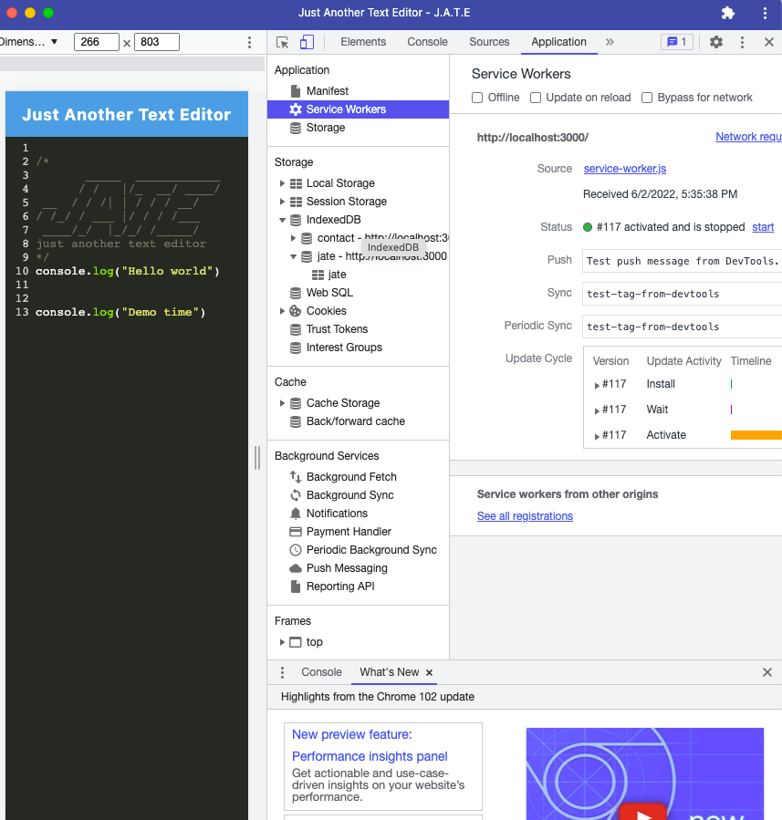

# Word Editor

## Description

This application has combined a lot of what we have learned in class so far. This application features a word editor that you may run in the browser and also download to your desktop; it should also work properly without internet. With this project we were supplied with some existing code that we had to add to in order to get a functioning application. This project solved the methods for getting and storing data to an IndexedDB database. I learned a lot about webpack config and package json editing this application.

## Installation

Steps required to install the project remotely include running npm i and npm start. From the text editor in the browser, you can enter content and click the Install button to download the application onto your desktop.

## Usage

    

## Credits

GitHub: https://github.com/fcarroll12/Word-editor
Heroku Deployed app: https://damp-thicket-46544.herokuapp.com/
